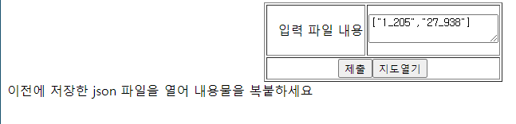

# genshinmap-ko

사용법

1. 필터를 여닫아 표시 항목 선택
2. 마크를 클릭해 완료/미완료 표기 가능

10/08 버전 원본에서 가져옴
https://gitee.com/blacklotusccw/yuan-shen-map

첫사용

index.html을 열어 사용

저장/불러오기

불러올 때에는 불러오기.html을 열고
이전에 저장한 json 파일을 메모장으로 열어 안의 내용물을 아래와 같이 입력한 후 제출 버튼을 누르기

불러오기 성공 메세지가 뜨면 지도 열기
